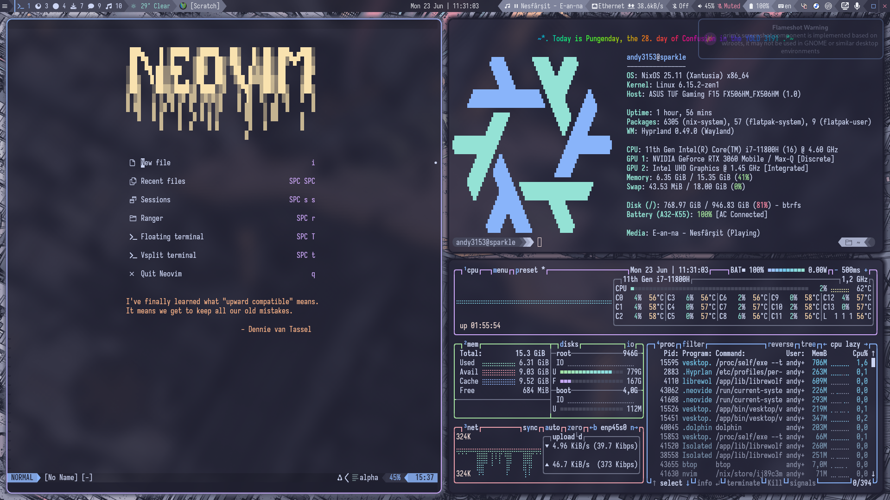

<!-- vim: set fenc=utf-8 ts=2 sw=0 sts=0 sr et si tw=0 fdm=marker fmr={{{,}}}: -->
# hyprland-rice


(seen in the screenshot: [NixOS config](https://github.com/Andy3153/nixos-rice), [Neovim config](https://github.com/Andy3153/andy3153-init.lua), [Zsh config](https://github.com/Andy3153/andy3153-zshrc))

## Dependencies
See [Andy3153/nixos-rice/modules/gui/rices/hyprland-rice](https://github.com/Andy3153/nixos-rice/blob/master/modules/gui/rices/hyprland-rice.nix).
- Needed programs:
  - `custom.extraPackages`
  - `home-manager.users.${mainUser}.wayland.windowManager.hyprland`
  - `home-manager.users.${mainUser}.programs`
  - `home-manager.users.${mainUser}.services`
- Needed scripts:
  - `home-manager.users.${mainUser}.home.file`
- Needed config files:
  - `home-manager.users.${mainUser}.xdg.configFile`
  - `home-manager.users.${mainUser}.xdg.dataFile`
- Used GTK/Qt themes, icon themes, fonts, cursors etc.:
  - `custom.gui`

## Installation
This Git repo contains `dotconfig` and `dotlocal`. These contain files that correspond to files that go in `~/.config` and `~/.local` respectively. So, you just have to symlink/copy the files you need into your respective folders.

Firstly, clone the repo:
```bash
cd /path/to/clone/folder/
git clone https://github.com/Andy3153/hyprland-rice/
```

(replace `/path/to/clone/folder/` with the folder you want to clone the Git repo inside.

Then, get the files you want in your configuration:

```bash
ln -s /path/to/clone/folder/hyprland-rice/dotconfig/EXAMPLE ~/.config
ln -s /path/to/clone/folder/hyprland-rice/dotlocal/EXAMPLE ~/.local
```
